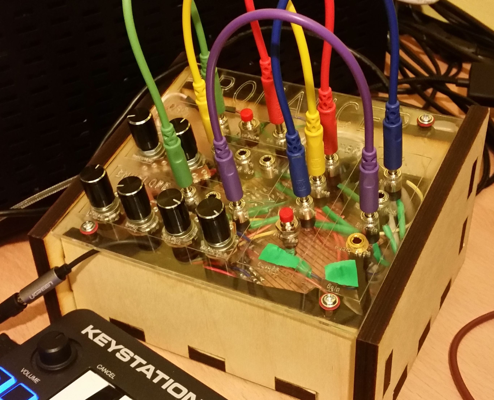

# piromancer-synth
A Raspberry Pi based semi-modular synthesiser, using [Pyo](https://github.com/belangeo/pyo).



## Licensing
All contents of this repository are released under GPLv3, with the exception of `synth/mcpaccess.py`, a modified version of [ladyada's MCP3008 driver program](https://gist.github.com/ladyada/3151375), which is released into the public domain in the same manner as the original.

## System Requirements
This software was originally designed for the original Raspberry Pi Model B, but this was confirmed to have insufficient compute power to run effectively.

However, the software functions correctly on a Raspberry Pi 3. More connections could be added due to its expanded GPIO.

## Installation
Install Jack audio server with alsa support:
```console
$ sudo apt-get install jackd2 alsaplayer-jack
```

Install [Pyo's dependencies](https://gist.github.com/pwalsh/8594869):
```console
$ sudo apt-get install python-dev libjack-jackd2-dev libportmidi-dev portaudio19-dev liblo-dev libsndfile-dev python-dev python-tk python-imaging-tk python-wxgtk2.8
```

Clone Pyo's repository, and enter its directory:
```console
$ git clone https://github.com/belangeo/pyo.git
```

[Install Pyo with Jack support, and Debian install layout](http://ajaxsoundstudio.com/pyodoc/compiling.html):
```console
$ sudo python setup.py install --install-layout=deb --use-jack
```

Provide the user with ownership of the audio output device, by adding the following to "/etc/dbus-1/system.conf":
```
<policy user="pi">
     <allow own="org.freedesktop.ReserveDevice1.Audio0"/>
</policy>
```

Clone this project's repository to the pi user's home directory:
```console
$ git clone https://github.com/BenClegg/piromancer-synth
```

## Execution
Simply run `startPiromancer.sh` to start the synthesiser. This script can be run on boot by executing `sudo crontab -e` and adding the following:
```
@reboot sh /home/pi/piromancer-synth/startPiromancer.sh >/home/pi/logs/cronlog 2>&1
```

If this "run on boot" cronjob is set, ownership of the audio output should instead be set to the root user, by changing the added code in "/etc/dbus-1/system.conf" to:
```
<policy user="root">
     <allow own="org.freedesktop.ReserveDevice1.Audio0"/>
</policy>
```

A "logs" directory should also be created inside the pi user's home directory.
